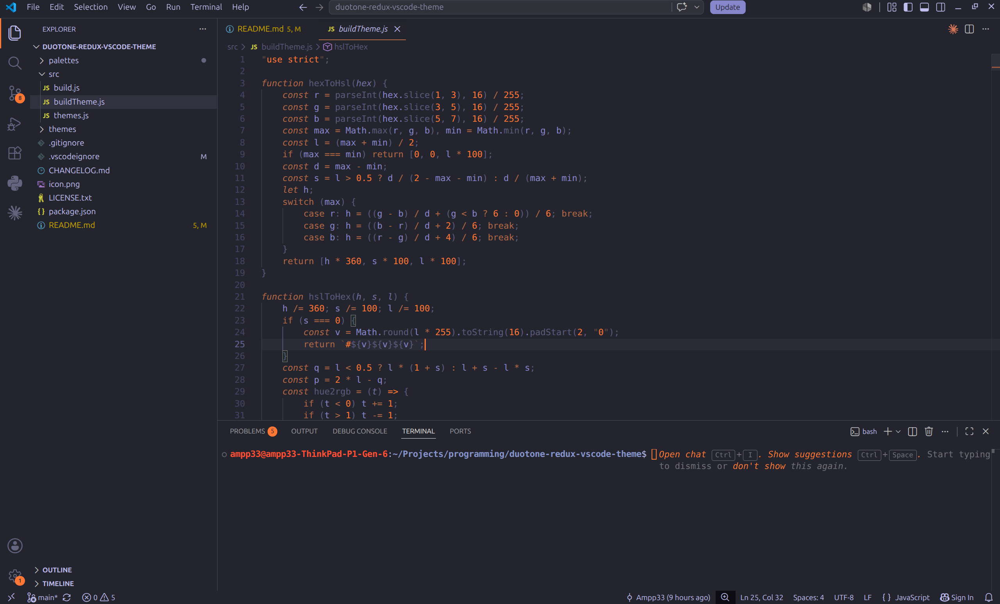

# DuoTone Redux

A from-the-ground-up reworked fork of the DuoTone dark themes for Visual Studio Code — every workbench surface (terminal, git decorations, diagnostics, menus, popups, borders, buttons, links) is generated from each variant's own two-hue palette, so the whole editor UI reads as one cohesive duotone instead of just the syntax highlighting.

## Installation

Search for **"DuoTone Redux"** in the VS Code Extensions view, or install from the [Visual Studio Code Marketplace](https://marketplace.visualstudio.com/items?itemName=ampp33.duotone-redux).

## Included Themes

- DuoTone Redux Sea
- DuoTone Redux Space
- DuoTone Redux Forest
- DuoTone Redux Sky
- DuoTone Redux Earth

Pick one from **File > Preferences > Theme > Color Theme** (`Ctrl+K Ctrl+T` / `Cmd+K Cmd+T`).

## How it works

Every theme is generated from `src/buildTheme.js`, a single shared formula driven by two small starter palettes per variant (`src/themes.js`): a cool/neutral "UNO" tint scale and a warm "DUO" accent scale. Run `npm run build` after editing either file to regenerate all five `themes/*.json` outputs.

## Credits

- Original concept: [DuoTone Dark Theme for Atom](https://github.com/simurai/duotone-syntax) by [Simurai](https://github.com/simurai)
- Original VS Code port: [vscode-duotone-dark](https://marketplace.visualstudio.com/items?itemName=sallar.vscode-duotone-dark) by [Sallar Kaboli](https://github.com/sallar)
- Multi-theme generator fork: [duotone](https://github.com/BrianDouglasIE/duotone) by [Brian Douglas](https://github.com/BrianDouglasIE)

## License

MIT — see [LICENSE.txt](./LICENSE.txt).
